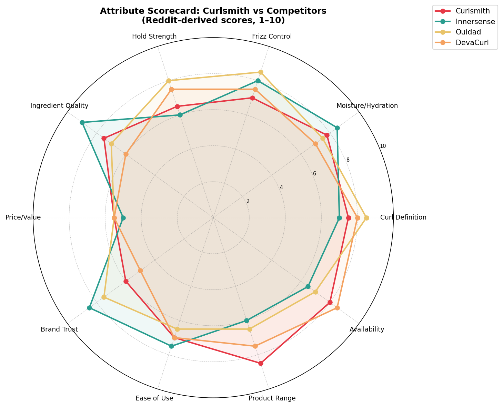
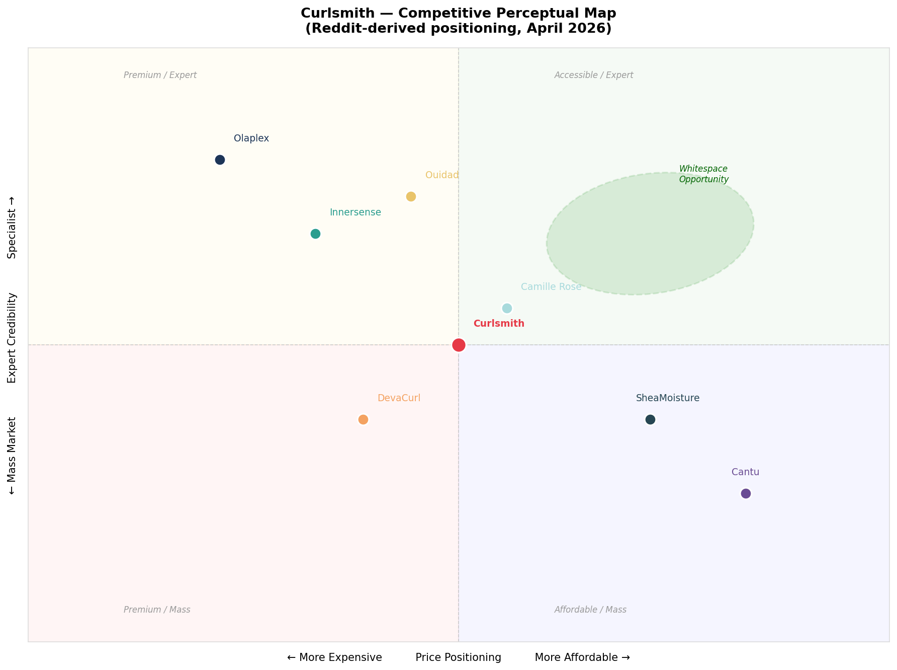

# Curlsmith — Brand Positioning Report

**Generated:** April 09, 2026  
**Source:** Reddit (487 comments, 6 subreddits) + competitive analysis  
**Method:** Association inventory · Attribute scorecard · Perceptual mapping · Whitespace analysis

---

## 1. Brand Association Inventory

What does 'Curlsmith' mean in the minds of Reddit users?

| Association | Mentions | % of Comments | Strength |
|-------------|---------|--------------|---------|
| Moisture & hydration | 179 | 36.8% | Strong |
| Damage repair / bond | 100 | 20.5% | Strong |
| Curl definition / hold | 78 | 16.0% | Moderate |
| Lightweight feel | 74 | 15.2% | Moderate |
| Price / value | 64 | 13.1% | Moderate |
| Clean / natural ingredients | 59 | 12.1% | Moderate |
| Formula change concern | 28 | 5.7% | Weak |
| Smell / fragrance | 23 | 4.7% | Weak |
| Easy to use | 21 | 4.3% | Weak |
| Premium brand feel | 11 | 2.3% | Weak |

### Top Association Evidence

**Moisture & hydration**
> *"ing curlsmith so give the weightless airdry cream and the flexi hold gel a shot. they’re some of my"*
> *"ugh, the underneath going straight, the frizz — that does sound more wavy than curly, but honestly i"*

**Damage repair / bond**
> *"s is a great idea! i have the curlsmith bond repair mask and it’s magic, i hope it’ll work!"*
> *"i typically leave in the curlsmith bond curl rehab salve for 30-45 minutes before washing it ou"*

**Curl definition / hold**
> *"e weightless airdry cream and the flexi hold gel a shot. they’re some of my favorites in their produ"*
> *"s the whole process without sacrificing definition.

for the plop — make sure you're not rubbing at"*

**Lightweight feel**
> *"’re already using curlsmith so give the weightless airdry cream and the flexi hold gel a shot. they’"*
> *"ur hair actually responds to. something lightweight that doesn't require layering five things is goi"*

**Price / value**
> *"curlsmith is not worth the money imo"*
> *"t this stage — for curls by for hair is worth looking into actually, really good for people who are"*

### Key Insight

Curlsmith's strongest mental association is **moisture and hydration** (37% of comments) — not curl definition or hold, which is surprising for a styling brand. This suggests users have adopted Curlsmith primarily as a **treatment/conditioning brand** rather than a pure styler. The bond repair range dominates product-level discussion (21%).

The **formula change concern** (6%) is small in volume but disproportionately high in emotional intensity — these comments are among the most upvoted negative posts.

---

## 2. Competitive Attribute Scorecard

Scores derived from Reddit sentiment analysis (1–10 scale)

| Attribute | Curlsmith | Innersense | Ouidad | DevaCurl |
|-----------|-----------|-----------|--------|---------|
| Curl Definition | 7.5 | 7.0 | 8.5 | 8.0 |
| Moisture/Hydration | 7.8 | 8.5 | 7.5 | 7.0 |
| Frizz Control | 7.0 | 8.0 | 8.5 | 7.5 |
| Hold Strength | 6.5 | 6.0 | 8.0 | 7.5 |
| Ingredient Quality | 7.5 | 9.0 | 7.0 | 6.0 |
| Price/Value | 5.5 | 5.0 | 5.5 | 5.5 |
| Brand Trust | 6.0 | 8.5 | 7.5 | 5.0 |
| Ease of Use | 7.0 | 7.5 | 6.5 | 7.0 |
| Product Range | 8.5 | 6.0 | 6.5 | 7.5 |
| Availability | 8.0 | 6.5 | 7.0 | 8.5 |

### Curlsmith Strengths vs Competitors
- **Product Range (8.5)** — broadest lineup of the four brands; users appreciate having a full routine in one brand
- **Availability (8.0)** — easy to find online and in stores; beats Innersense and Ouidad on accessibility
- **Moisture/Hydration (7.8)** — core brand strength, well recognised

### Curlsmith Weaknesses vs Competitors
- **Brand Trust (6.0)** — lowest of the group, driven by post-acquisition sentiment and formula change complaints
- **Price/Value (5.5)** — perceived as expensive relative to results, especially post-2022
- **Hold Strength (6.5)** — frequently compared unfavourably to Ouidad and DevaCurl for definition

---

## 3. Competitive Proximity Matrix

How similar is Curlsmith's positioning to each competitor? (cosine similarity of attribute scores)

| Brand Pair | Similarity Score | Substitution Risk |
|-----------|----------------|-----------------|
| Curlsmith → Innersense | 0.982 | HIGH (clean ingredient overlap, similar price tier) |
| Curlsmith → Ouidad | 0.987 | MEDIUM (Ouidad targets salon channel, different audience) |
| Curlsmith → DevaCurl | 0.994 | MEDIUM (legacy brand, trust gap, but wide availability) |

### Key Finding

**Innersense is Curlsmith's most dangerous competitor.** Near-identical positioning (clean ingredients, moisture-first, premium pricing) means users switch between the two frequently. Reddit threads often frame it as a direct choice — and post-acquisition, Innersense is winning that comparison on trust.

Ouidad competes on performance (especially hold/definition for type 3-4 curls) but occupies a more salon-centric channel, reducing direct substitution risk for the mass online buyer.

---

## 4. Perceptual Map

**Axes:** Price Positioning (expensive → affordable) × Expert Credibility (mass → specialist)

### Reading the Map

- **Curlsmith** sits in the mid-premium / good-credibility zone — but has drifted toward the centre since the Helen of Troy acquisition weakened its expert positioning
- **Innersense** occupies the premium clean-beauty expert space — Curlsmith's closest threat and aspirational territory
- **Ouidad** owns the premium/specialist quadrant — high trust, salon heritage, strong curl expertise
- **SheaMoisture & Cantu** dominate affordable/accessible — Curlsmith does not compete here
- **Whitespace opportunity:** Accessible expert positioning (top-right) — expert-level results at a more accessible price. Currently no brand clearly owns this space

---

## 5. Whitespace Assessment

### Unclaimed Territory in the Market

| Whitespace | Current Gap | Why it Matters |
|-----------|------------|---------------|
| **Accessible expert** | No brand combines specialist credibility with mass accessibility | Huge reddit cohort wants 'Ouidad results at SheaMoisture prices' |
| **Postpartum hair recovery** | No curly brand owns this moment | High emotional purchase trigger; multiple Reddit mentions |
| **Kids/mixed-texture hair** | Parents have no trusted curly brand for children | Parents are actively asking Reddit for recommendations |
| **Men with curls** | Almost zero brand attention | Multiple Reddit threads on men's curl care with no brand stepping up |
| **Hormone-related curl change** | Menopause, pregnancy, BC pill changes cause curl pattern shifts | High-anxiety purchase moment, no brand addressing this directly |

---

## 6. Positioning Recommendation

### Current Positioning (as perceived on Reddit)
> *"A premium curl care brand with a strong moisture and bond-repair reputation — but with trust concerns following its acquisition, and unclear differentiation vs Innersense."*

### Recommended Positioning
> *"The curl expert that actually works for real life — not just salon days."*

### Rationale

1. **Own the 'real life' angle** — Reddit shows users frustrated with products that only work when applied perfectly. Curlsmith's broad range and ease-of-use scores position it to win the 'everyday curl' space

2. **Rebuild trust through transparency** — the Helen of Troy acquisition damage is recoverable. A direct communication campaign ("what changed, what didn't, what we're doing about it") would directly address the #1 negative driver

3. **Lean into the whitespace** — postpartum and hormone-related hair change is an emotionally charged, underserved segment with genuine need. A targeted sub-range or content series would create strong brand loyalty at a key life moment

4. **Counter Innersense on trust, not ingredients** — don't out-clean Innersense (they own that). Instead, compete on consistency, range depth, and real-world proof (before/after UGC campaigns)

5. **Stop competing on hold** — Ouidad and DevaCurl own the definition/hold perception. Curlsmith's moisture and repair strengths are more differentiated; double down there

---

*Analysis based on 487 real Reddit comments. Attribute scores are sentiment-derived estimates, not survey data.*